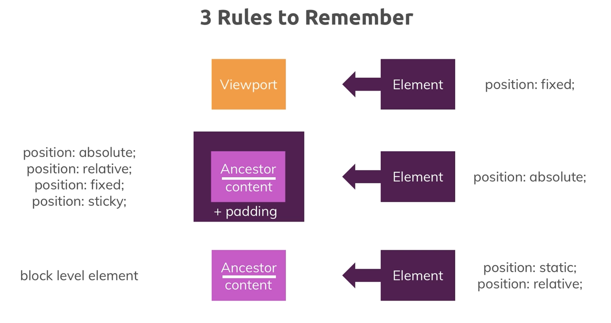

# CSS

<!-- TOC -->
* [CSS](#css)
  * [Important Links](#important-links)
  * [Selectors](#selectors)
  * [Inheritance](#inheritance-)
  * [Specificity](#specificity)
  * [Combinator](#combinator)
  * [Box Model](#box-model)
    * [Margin Collapsing:](#margin-collapsing-)
    * [Box Sizing:](#box-sizing)
    * [Display](#display)
  * [Text Decoration](#text-decoration-)
  * [Pseudo classes, pseudo elements, and grouping rules](#pseudo-classes-pseudo-elements-and-grouping-rules)
    * [:not(selector)](#notselector)
    * [!important](#important)
  * [Element Outline](#element-outline)
  * [Float](#float)
  * [Element Positioning](#element-positioning)
    * [Background Positioning vs. Image Positioning](#background-positioning-vs-image-positioning-)
  * [Gradients (linear and radial)](#gradients-linear-and-radial)
  * [Filters](#filters)
  * [SVG](#svg)
  * [Sizing Units (px, %, em, rem, vw, vh, auto)](#sizing-units-px--em-rem-vw-vh-auto)
    * [Where sizing rules apply and make the most sense](#where-sizing-rules-apply-and-make-the-most-sense)
    * [Absolute Lengths (px, cm, mm)](#absolute-lengths-px-cm-mm)
    * [Viewport Lengths (%, vw, vh, vmin, vmax)](#viewport-lengths--vw-vh-vmin-vmax)
    * [Font-Related Lengths (rem and em)](#font-related-lengths-rem-and-em)
    * [margin:auto](#marginauto)
  * [Working with JavaScript and CSS](#working-with-javascript-and-css)
  * [Meta tags and @Media Queries for Responsive Design](#meta-tags-and-media-queries-for-responsive-design)
  * [Styling Inputs](#styling-inputs)
  * [Text & Fonts](#text--fonts)
    * [@font-face](#font-face)
    * [Font File (Type) Formats](#font-file-type-formats)
    * [Font Properties](#font-properties)
    * [Font Display Property](#font-display-property)
  * [Flexbox](#flexbox)
    * [Flex Containers](#flex-containers)
    * [Main Axis vs. Cross Axis](#main-axis-vs-cross-axis)
    * [Flex Items](#flex-items)
<!-- TOC -->


## Important Links
- [Udemy Complete Guide](https://www.udemy.com/course/css-the-complete-guide-incl-flexbox-grid-sass/learn/lecture/9462698?components=add_to_cart%2Cavailable_coupons%2Cbase_purchase_section%2Cbuy_button%2Cbuy_for_team%2Ccacheable_buy_button%2Ccacheable_deal_badge%2Ccacheable_discount_expiration%2Ccacheable_price_text%2Ccacheable_purchase_text%2Ccurated_for_ufb_notice_context%2Ccurriculum_context%2Cdeal_badge%2Cdiscount_expiration%2Cgift_this_course%2Cincentives%2Cinstructor_links%2Clifetime_access_context%2Cmoney_back_guarantee%2Cprice_text%2Cpurchase_tabs_context%2Cpurchase%2Crecommendation%2Credeem_coupon%2Csidebar_container%2Cpurchase_body_container#announcements){:target="_blank"}
- [World Wide Web Consortium (W3C) CSS Working Groups](https://www.w3.org/TR/tr-groups-all#tr_Cascading_Style_Sheets__CSS__Working_Group){:target="_blank"}
- [Complete MDN CSS Reference (Don't learn this by heart!)](https://developer.mozilla.org/en-US/docs/Web/CSS/Reference){:target="_blank"}
- [Do you prefer reading? Find written CSS docs on MDN](https://developer.mozilla.org/en-US/docs/Web/CSS){:target="_blank"}
- [Common CSS Properties Reference](https://developer.mozilla.org/en-US/docs/Web/CSS/CSS_Properties_Reference){:target="_blank"}

## Selectors

| Selector     | Use                  | Description                            |
|--------------|----------------------|----------------------------------------|
| element      | element-to-select {} | Direct element selection               |
| class  {}    | .class-to-select {}  | Apply to all with this class           |
| id           | #id-to-select {}     | Apply to the only element with this id | 
| all elements | * {}                 | Apply  to all elements (rarely used)   |
| attribute    | [attr-to-select] {}  | Apply  to all elements (rarely used)   |


## Inheritance 

This means the child elements inherit some styles from its parent element.  
The *{} doesn't use inheritance, it applies to all elements. It is not performant and has a low priority.  
Typically you don't use the *{} as it is better to use the body tag.
Directly selected element have a higher specificity than inheritance.

## Specificity

- [More details on CSS Specificity](https://developer.mozilla.org/en-US/docs/Web/CSS/Specificity){:target="_blank"}

Specificity is the algorithm used by browsers to determine the CSS declaration that is the most relevant to an element, which in turn, determines the property value to apply to the element. The specificity algorithm calculates the weight of a CSS selector to determine which rule from competing CSS declarations gets applied to an element.


## Combinator

- [CSS Combinators](https://developer.mozilla.org/en-US/docs/Learn/CSS/Introduction_to_CSS/Combinators_and_multiple_selectors){:target="_blank"}

| Combinator       | Use                    | Description                                 | Example                                                |
|------------------|------------------------|---------------------------------------------|--------------------------------------------------------|
| Descendant       | selector selector {}   | Any descendant of the first selector        | h2 p {}  Any p tag within an h2 tag                    |
| Child            | selector > selector {} | Direct descendant of first selector         | h2 > p {} Any p tag direct child of h2 tag             |
| Adjacent Sibling | selector + selector {} | Think: li + li selects al but the first li. | h2 + p {} Any p tag sibling directly after an h2 tag   |
| General Sibling  | selector ~ selector    | Siblings of first selector                  | h2 ~ p {} Any p tags with the same parent as an h2 tag |


## Box Model

- [CSS Box Model](https://developer.mozilla.org/en-US/docs/Learn/CSS/Introduction_to_CSS/Box_model){:target="_blank"}


### Margin Collapsing: 

- [Good Margin Collapsing article](https://developer.mozilla.org/en-US/docs/Web/CSS/CSS_Box_Model/Mastering_margin_collapsing){:target="_blank"}

1. Overlaps with adjacent siblings so the larger margin wins.
2. A parent that has children with margins, the top and bottom margin of the parent will collapse with the top of the first child element and the bottom of the second child element.
3. An element with margin, but without content, height, padding, or borders, will collapse the top and bottom margins into one margin.

### Box Sizing:

- [box-sizing](https://developer.mozilla.org/en-US/docs/Web/CSS/box-sizing){:target="_blank"}
- [More on height & width](https://www.w3schools.com/css/css_dimension.asp){:target="_blank"}

| box-sizing   | When Used?          | Description                                          |
|--------------|---------------------|------------------------------------------------------|
| content-box  | default             | Width and Height values direct the content           |
| border-box   | best option         | Use * { box-sizing: border-box; } to set everywhere. |

### Display

- [The display  Property](https://developer.mozilla.org/en-US/docs/Web/CSS/display){:target="_blank"}

| display      | When Used?                           | Description                                                                                                                             |
|--------------|--------------------------------------|-----------------------------------------------------------------------------------------------------------------------------------------|
| block        | default for many elements            | Takes the entire width eg. body, sections, etc                                                                                          |
| inline       | default for paragraph type elements  | Only takes its content width                                                                                                            |
| inline-block | combines the best of both            | Used when designing more interesting layouts                                                                                            |
| none         | to control visibility via JavaScript | Removes element form document flow and visibility. Note: Use visibility to hide element but maintain its position in the document flow. |
 
**Block-level elements** are rendered as a block and hence take up all the available horizontal space. You can set margin-top and margin-bottom and two block-level elements will render in two different lines.  
Some examples are: `<div>` , `<section>` , `<article>` , `<nav>`  but also `<h1>` , `<h2>`  etc and `<p>` .

**Inline elements** on the other hand only take up the space they require to fit their content in. Hence two inline-elements will fit into the same line (as long as the combined content doesn't take up the entire space in which case a line break would be added).  

They also use the box-model you learned about but margin-top  and margin-bottom  have no effect on the element. padding-top  and padding-bottom  also have a different effect. They don't push the adjacent content away but they will do so with the element border. You can read more about that behavior in the following article: https://hacks.mozilla.org/2015/03/understanding-inline-box-model/  

Additionally, setting a width  or height  on an inline element also has no effect. The width and height is auto to take as much space as required by the content.  

Logically, this makes sense since you don't want your inline elements to destroy your multi-line text-layout. If you want to do so or need both block-level and inline behavior, you can set display: inline-block  to merge behaviors.  

Some example elements are: `<a>` , `<span>` , ``  

**IMPORTANT NOTE:** When using display: inline-block, the white space in the HTML document will be included as more inline and can take up horizontal space. In this case, the best thing to do is subtract some width from other elements to make up for it.  

## Text Decoration 
Different element types may add styles to text element like `<a>` makes a link look. To remove these, use:   
`text-decoration: false;`

## Pseudo classes, pseudo elements, and grouping rules

- [Pseudo Classes on the MDN](https://developer.mozilla.org/en-US/docs/Web/CSS/Pseudo-classes){:target="_blank"}
- [Dive deeper into Pseudo Elements](https://developer.mozilla.org/en-US/docs/Web/CSS/Pseudo-elements){:target="_blank"}

Pseudo classes (:) let us define a style for a **_special state_** of an element.  
```
.someClass a:hover,
.someClass a:selected {
    color: white;
}
```

Pseudo elements (::) let us define a style for a _**specific part**_ of an element:
```
.someClass p::first-letter {
    color: red;
    font-size: 40px;
    font-weight: bold;
    border-bottom: 2px solid, white;
}
```

### :not(selector)

- [:not(pseudo) class:](https://developer.mozilla.org/en-US/docs/Web/CSS/:not){:target="_blank"}

Allows you to select any element that does not fit the criteria.
```
a.active {
    color: blue;
}

a:not(.active){
    color: white;
}
```

### !important

- [When using !important is the right choice](https://css-tricks.com/when-using-important-is-the-right-choice/){:target="_blank"}

Overwrites specificity for all other selectors (Not a great idea to use this, so use it wisely)
```
.someClass {
    color: white !important;
}
```

## Element Outline
The outline is an additional border-like thing that show when a particular element is active. This is what happens when 
you tab around in a document. Note it is not actually part of the document box, and takes no space in the model. To turn it off,
```
.button:focus {
    outline: none;
}
```

## Float
Overwrite the default positioning and push it to the right or left.

 - [More on float:](https://developer.mozilla.org/en-US/docs/Web/CSS/float){:target="_blank"}

Note that float takes the element out of the document flow, which can be troublesome for the following objects. This 
is also why it isn't used much any more. Flexbox and the like are newer and better alternatives.

To correct the float problem add a similar element after the floated element and clear its floating as follows:
```
<div class="clearfix" ></div>

.clearfix {
    clear: both;
}
```

## Element Positioning

- [Positioning theory](https://developer.mozilla.org/en-US/docs/Learn/CSS/CSS_layout/Positioning){:target="_blank"}
- [More about the "position" property](https://developer.mozilla.org/en-US/docs/Web/CSS/position){:target="_blank"}
- [The z-index](https://developer.mozilla.org/en-US/docs/Web/CSS/z-index){:target="_blank"}
- [The Stacking Context](https://developer.mozilla.org/en-US/docs/Web/CSS/CSS_Positioning/Understanding_z_index/The_stacking_context){:target="_blank"}
- [The "sticky" value and current browser support](https://caniuse.com/#search=sticky){:target="_blank"}

Position Properties: top, right, bottom, left, and z-index

| position | Position Context                                 | Description                                                                                                                                             |
|----------|--------------------------------------------------|---------------------------------------------------------------------------------------------------------------------------------------------------------|
| static   | default position in document flow.               | From the position to element has in the document flow. Position properties don't apply                                                                  |
| fixed    | view port                                        | Takes the element out of the document flow. Becomes an inline-block element. Like a flyover                                                             |
| absolute | HTML element or closest parent with position set | Takes the element out of the document flow.                                                                                                             |
| relative | default position in document flow.               | Does not take the element out of the document flow. Positioned from its original position. This is also a way to mark a context for absolute positioning. |
| sticky   | view port + parent content                       | This is a combination of relative and fixed, the element will move until it hits some boundary and then stops moving.                                   |

Note: adding overflow: hidden to a parent, will hide a child if its position properties take out of the parents boundaries. Think of it as like scrolling.  

Stacking context:
The order of element display in the order they are written in the document; provided all z-index are zero.
By adding a position properties to an element, that element then has its own position context and z-index will only work with it children.

**Important Note:** Z-Index only effects with position properties set to something other than static (default). This 
doesn't apply to flex items. That is, you don't need a position property on a flex container to set the z-index.

### Background Positioning vs. Image Positioning 
**background-image** is more flexable and should be used if you need such flexibility.  
**img** is better for simple images that fit into the normal document flow.

- [The background Property](https://developer.mozilla.org/en-US/docs/Web/CSS/background){:target="_blank"}
- [Styling Images](https://www.w3schools.com/css/css3_images.asp){:target="_blank"}
- [Filters](https://developer.mozilla.org/en-US/docs/Web/CSS/filter){:target="_blank"}
- [Styling SVG](https://developer.mozilla.org/en-US/docs/Web/SVG/Tutorial/SVG_and_CSS){:target="_blank"}

**Background property shorthand** is the technique for using one css property for settings.   
This can get complicated for background setting and is not intuitive as there are many different settings available. 
**IMPORTANT NOTE** When using specific settings, that eventually cascade over by a shorthand version missing some of the 
settings, the defaults set by the shorthand will override the previously set values. **IMPORTANT**

```
    background-image: url("images/freedom.jpg");
    background-position: left 10% bottom 30%;
    background-size: cover;    
    background-repeat: no-repeat;
    background-origin: border-box;
    background-clip: border-box;
    background-attachment: scroll;
```
becomes:
```
    background: url("images/freedom.jpg") left 10% bottom 30%/cover no-repeat border-box, #ff1b68;
```

Notes:  
```    
    background-size: Sets the width, and the height is set to maintain the aspect ratio.  
                     cover: picks 100% either width or height, for best aspect ratio to fill the defined space.
                     contain: shows full images, maintains aspecpt ratio either side or bottom may show white space.  
    background-repeat: Repeats the image with some controls no-repeat, or repeat-x, repeat-y.      
    background-position: x-axis to left edge, y-axis from top.  
                         using a percent indicates how much will be cropped from left or top.  
                         center 50% of any extra will be cropped.  
                         
    background-origin: border-box: set image under border.
                       content-box: in content area.
                       padding-box: fills padding area as well
    background-clip: same settings as origin
    background-attachment: sets how the images is attached to the rest of the page
                           fixed: fixed to the view port so the image scrolls with the page
                           scroll: images maintains its location and scrolls within its parent
                           local: images scrolls with content. (sounds like fixed!?!)
```                   

**Image Positioning**
- Defaults to image size
- Select img setting height: means the height of the image?
- **IMPORTANT NOTE:** height and width will respect parent only if the parent is inline-block (hmmm feels tricky) 


## Gradients (linear and radial)
Gradients are considered images.  
Control settings like direction, color/colors, transparency, etc.  
Radial gradients have more options for flexing the radial aspect.

```
    background-image: linear-gradient(red, blue);
```

Background images can also be layered with comma separated entries for each layer.  
In the following example we have three layers, a translucent linear-gradient, over a specifically positioned image, 
lastly over a solid color.

Note: layering will only accept one solid color layer.

```
    background: linear-gradient(to top, rgba(80, 68, 18, 0.6) 10%, transparent), 
                url("images/freedom.jpg") left 10% bottom 30%/cover no-repeat border-box, 
                #ff1b68;
```

```
    background: linear-gradient(to top, rgba(80, 68, 18, 0.6) 10%, transparent), url("images/freedom.jpg") left 10% bottom 30%/cover no-repeat border-box, #ff1b68;
```

## Filters
Filters are applied over the images, there are many options, look them up!
```
div {
    background-color: red;
    filter: blur(10px);
}
```

## SVG
SVG is based on HTML code. Look into details outside of this document

## Sizing Units (px, %, em, rem, vw, vh, auto)

- [Font size properties and values](https://developer.mozilla.org/en-US/docs/Web/CSS/font-size){:target="_blank"}
- [Viewport units and browser support](https://caniuse.com/#search=vh){:target="_blank"}



### Where sizing rules apply and make the most sense


### Absolute Lengths (px, cm, mm)
The browser will mostly ignore its user settings.  
There are other measurement based setting like cm, mm, etc. Avoid using these types.  


### Viewport Lengths (%, vw, vh, vmin, vmax)
These settings are based on some percentage of the size and positioning settings of the containing block.   
They adjust dynamically based on the current viewport conditions.  

**100vw** refers to 100% of the viewport width.  
**85vh** refers to 85% of the viewport height.  
**50vmin** refers to 50% of the smaller length of either viewport width or height.  
**75vmax** refers to 75% of the larger of the viewports sizes.


### Font-Related Lengths (rem and em)
These lengths are calculated on the default font size based on the HTML or ROOT element. These also adjust dynamically
if the user modifies the browser settings.  

**rem**: Fixed to the HTML or ROOT font size. Modify rem at the html element for entire document control.  
It is a good idea to figure out what 1.0 rem is in px for your development browser and calculate modifications from there.  

**em**: Based on the font sized going up the ancestry line. This can be tricky as the ancestors may have 
calculations of their own. **Careful!** This is not often used without specific intent!  

### margin:auto
**margin:auto** Asks the browser to set the left and right margin evenly to center the element.  
**IMPORTANT NOTE:** margin:auto only works for block level elements with an explicitly assigned width!


## Working with JavaScript and CSS

- [JavaScript Basics](https://academind.com/learn/javascript){:target="_blank"}
- [JavaScript CSS Styles](https://developer.mozilla.org/en-US/docs/Web/API/HTMLElement/style){:target="_blank"}
- [ELEMENT.classList](https://developer.mozilla.org/en-US/docs/Web/API/Element/classList){:target="_blank"}

JavaScript can be used to update actual element styles, but it is better to create classes to add/remove from the elements.

Element Examples
```
button.style.backgroundImage = 'image.png';    
button.style['background-image'] = 'image.png';
button.classList.add('className');
button.classList.remove('className');
```

<div style="text-align: center;">
    <h1>THINK MOBILE FIRST FROM NOW ON</h1>
    <p>Start by designing the pages for a cell phone sized screen, then use media queries to adjust the styling for larger screens.</p>
</div>


## Meta tags and @Media Queries for Responsive Design

The viewport meta element is what turns a regular website page into a responsive page, 
and it's also one of the number one reason for StackOverflow questions on why their media queries are not working.  

- [Absolute lengths on W3.org](https://www.w3.org/TR/css-values-3/#absolute-lengths){:target="_blank"}
- [Quick meta tag overview](https://ui.dev/rwd/develop/responsive-html/viewport-meta-element){:target="_blank"}
- [Media queries theory](https://developer.mozilla.org/en-US/docs/Web/CSS/Media_Queries){:target="_blank"}
- [Applying media queries](https://developer.mozilla.org/en-US/docs/Web/CSS/Media_Queries/Using_media_queries){:target="_blank"}
- [Check your current device scale](mydevice.io){:target="_blank"}

Understand the difference between **Hardware Pixels** and **Software Pixels**  
One example of this is when you see a web page on a cell phone that looks like it should be on a computer.
Use a **viewport** <meta> tag to tell the browser to set the width of the content to the width of the device itself, 
and to scale that content to 1 on load.

```
    <meta name="viewport" content="width=device-width, initial-scale=1.0">
    where:
    width=device-width - Aligns HW and SW pixels.
    inital-scale=1.0 - Think of this as not being zoomed in
    user-scalable=yes - (default) Allows user to zoom(scale) viewport. DON'T USE!!!
    minimum-scale=1.2 and maximum-scale=2.0 - puts bounaries on the zoom at 1.2% and 2.0% of scale respectively.
```

With the viewport set and all styling set for cell phone sized screen, use media queries at the end of
each style sheet to adjust for when the screen crosses defined pixel boundaries: 

In this example if the screen crosses 40rem (40 * 1rem or in my case 16pixels) apply this set of styles to 
1) Hide a button, maybe a mobile friendly nav menu
2) Show a large screen friendly nav menu and adjust its alignment
3) Reformat the footer for a larger page width

```
@media (min-width: 40rem) {
    .toggle-button {
        display: none;
    }

    .main-nav {
        display: inline-block;
        text-align: right;
        width: calc(100% - 44px);
        vertical-align: middle;
    }

    .main-footer__link {
        display: inline-block;
        margin: 0 1rem;
    }
}
```

**ORDER MATTERS!** @media queries must honor CSS cascade theory, so if there are more than two transitions, they must be ordered 
in the .css file in a continuous direction. For mobile first is it from smallest to largest. 

``` 
... defaul or no media query
@media (min-width: 40rem) {...}
@media (min-width: 60rem) {...}
etc...
```

## Styling Inputs

- [Styling Form Elements](https://developer.mozilla.org/en-US/docs/Learn/HTML/Forms/Styling_HTML_forms){:target="_blank"}
- [Styling a select Element](https://stackoverflow.com/questions/1895476/how-to-style-a-select-dropdown-with-css-only-without-javascript){:target="_blank"}

Input fields typically have many browser default styles, override them for best results.  
Always include label elements for each input field as this is the now standard.  

There are many ways to select attributes:  


This is a good example for styling disabled buttons
```
.button[disabled] {
    cursor: not-allowed;
    border-color: #a1a1a1;
    background-color: #ccc;
    color: #a1a1a1;
}
```

Use pseudo selectors when validating form inputs:
```l
.signup-form :invalid {
    border-color: #ff5454 !important;
    background: #faacac;
}
```
Also notice the space before :invalid, this is intended and read as all invalid descendent elements to .signup-form.

## Text & Fonts

- [Web Safe Fonts](https://www.cssfontstack.com/){:target="_blank"}
- [Google Fonts](https://fonts.google.com/){:target="_blank"}
- [The "line-height" property](https://developer.mozilla.org/en-US/docs/Web/CSS/line-height){:target="_blank"}

The browser (user agent) has a default set of font families....


And must decide which font is being displayed based on default and css settings...


**Avoid using local** (user computer based fonts) if possible. Specify and provide the fonts in the project.  
**Web fonts** are retrieved from the internet by Linking into the header of the page...

```
<head>
    <meta charset="utf-8">
    <link rel="stylesheet" href="https://fonts.googleapis.com/css?family=Montserrat:400,700">
    ...
</head>
```

Or the preferred method of @importing via the primary global css file...

```
@import url('https://fonts.googleapis.com/css?family=Anton');               
@import url('https://fonts.googleapis.com/css?family=Montserrat:400,700');  /* This pulls directlry from google fonts */
@import url('https://fonts.googleapis.com/css?family=Roboto:400,900');

* {
  box-sizing: border-box;
}

body {
  font-family: "Montserrat", sans-serif;   /* font family in order of preference */
  margin: 0;
}
```

**Project supplied fonts** are retrieved from google and provided by the project as a resource using @font-face

### @font-face

Use @font-face to import specific font files...  
You must specify each file as follows:  

```
@font-face {
    font-family: 'AnonymousPro';
    src: url("anonymousPro-Regular.ttf") format("truetype");
}

@font-face {
    font-family: 'AnonymousPro';
    src: url("anonymousPro-Bold.ttf") format("truetype");
    font-weight: bold;
}
```
### Font File (Type) Formats

**ttf: True Type Format** is generally available and works well for most cases.  
**otf: Open Type format** is true type, open supported similar to .ttf
**woff: Web Open Font Format** is true type, and open, with better compression & better browser support. 
**woff2** has even better compression but is not yet supported by all browsers, so avoid for now.

### Font Properties

Fonts properties topic is a big one, much too big for this guide,  
[This Udemy Course Section is worth the watch](https://www.udemy.com/course/css-the-complete-guide-incl-flexbox-grid-sass/learn/lecture/9615478#announcements){:target="_blank"}

Here are a few for example:
```
- font-size: 2rem;
- font-weight: 400;    /* or normal */ this is the default.
- font-style: italic;  /* NOTE: the browser can sometimes fake italic if it is not provided, it looks different */
- font-variant: small-caps;
- font-stretch: ultra-condensed; /* look it up */
- letter-spacing: 5px; /* the space between letters */
- white-space: nowrap; /* how to handle white space (normal, nowrap, pre, pre-wrap) pre uses white space from html file */
- line-weight: 2;      /* this means (font-weight * 2) depending on the font-family */ 
- text-decoration: underline;  /* underline, overline, lin-through, dotted, color, wavy */
- text-shadow: x-offset y-offset blur color; 
```

There are shorthands, look them up!
```
    font: style variant weight size/line-height family...
```

### Font Display Property

The font display property impacts the loading of font, this has to do with which font is being displayed at which time 
in the page loading process along with the formula used to decide when to fallback to other choices.


## Flexbox

- [Flexbox and browser compatibility](https://caniuse.com/#search=flexbox){:target="_blank"}
- [The theory behind flexbox](https://developer.mozilla.org/en-US/docs/Web/CSS/CSS_Flexible_Box_Layout/Basic_Concepts_of_Flexbox){:target="_blank"}
- [The flex container with live demo](https://developer.mozilla.org/en-US/docs/Glossary/Flex_Container){:target="_blank"}

Flexbox is made up of **Flex Containers** and **Flex Items**.  
A Flexbox container can be nested into parent Flexbox container.

### Flex Containers
```
.your-flex-container {
  display: flex;                                                          /* Turn any element into a flex box */
  flex-direction: row (default) | row-reverse | column | column-revers;   /* Direction of the item flow */
  flex-wrap: nowrap (default) | wrap | wrap-reverse;                      /* Wrap behavior */
  /* shorthand */
  flex-flow: direction wrap;  /* It is better to just specify these settings */
}
```
A flex container marks the space the flex items will work with. The default idea is that the items will attempt to fill 
that space. The fewer sizing properties provided, the more flex-box tries to fill that space. For instance:

- Rows will take the height of the larges item, and all non-restricted items will also take that height.
- Column works sort of as if all the items are block level elements, it will fill as much width as the space provided. 
- Once you add alignment or size properties, the behavior reacts accordingly and interestingly.

When thinking about the flex-direction and wrap, as well as aligning and box positioning, it is very important to think
about the Main Axis vs. the Cross Axis. The following settings are based on the axis:

**align-items:**      Sets the align-self value on all **direct children** as a group. In Flexbox, it controls the alignment of items on the **CROSS Axis**.  
**justify-items:**    Defines the default justify-self for all items of the flexbox, giving them all a default way of justifying each box along the **appropriate axis**.  
**justify-content:**  Defines how the browser distributes space between and around content items along the **MAIN axis** of a flex container.  
**align-content:**    Sets the distribution of space between and around content items along a flexbox's **CROSS axis**.  

### Main Axis vs. Cross Axis


```
.your-flex-container {
  display: flex;                                                          /* Turn any element into a flex box */
  flex-direction: row (default) | row-reverse | column | column-revers;   /* Direction of the item flow */
  flex-wrap: nowrap (default) | wrap | wrap-reverse;                      /* Wrap behavior */
  
  align-items: 
  /* The default depends on */
}
```

### Flex Items

**align-self:** Overrides a flex item's align-items value. In Flexbox, it aligns the item on the **CROSS axis**.  
**justify-self:** Sets the way a box is justified inside its alignment container along the **appropriate axis**.  

**flex-grow:** values 1, 2, 4, 100... Place on flex items to grow into available space. Add the property values together
to identify the entire space, then divide that space based on the distribution of the values assigned to each item. If
only one element has a flex-grow property, then it will take all the available space.

**flex-shrink:** Sets the flex shrink factor of a flex item. If the size of all flex items is larger than the flex container, 
items shrink to fit according to flex-shrink. See flex-grow for distribution model.

**order:** sets the order to lay out an item in a flex or grid container. Items in a container are sorted by ascending 
order value and then by their source code order. Items not given an explicit order value are assigned the default value of 0.
