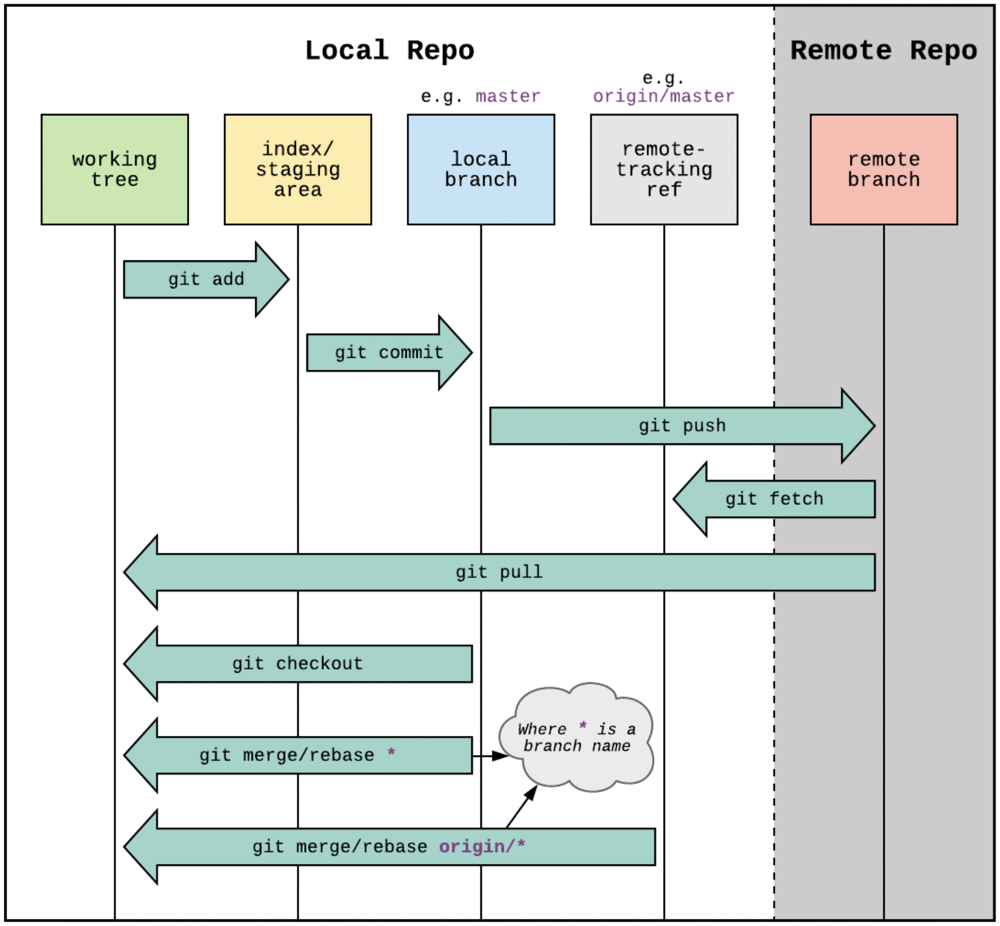

# git

Working with a FORK
I manually committed a change to the upstream origin, then committed changes to my fork before pulling in those changes from the upstream origin. This put my pull request into a shambles. I put in a bunch of dumb revert commits etc.

How did I fix this ???
$ `git reset --soft  HEAD~7`     # Resets all my changes back into staged  
$ `git stash push`               # Keep a copy of my changes (WebStorm calls this shelf)  
$ `git pull`                     # Restore my changes  
$ `git reset --hard HEAD~7`      # Delete all of those changes  
$ `git push -f`                  # Force those deletes up to GitHub  
From GitHub, I can now see that I have to pull in changes from the upstream origin
Do that and pull those changes back into my local repo.  
Un-shelve my changes and commit them one at a time, testing the pull request and deploy process.  
Open a Pull Request  
Add a note and Create the pull request  
Vercel needs me to verify the pull "I am a team member, so click on the link and do so"  
!!! Wait until Vercel builds and deploys the preview  
Check the preview then go back to Pull Request  
If all is good, The Rebase and Merge button will be GREEN. Hit It!  
Confirm the rebase and merge.  
Check the code.  

### Important Note: 
Merging from the fork's-main into the origin-main causes a the fork's-main to x commits ahead and x commits behind.
This is because we merged the main. To correct this, I had to delete the x commits form the fork and sync up with the origin-main. Then on my local development version, I had to pull in those changes, then checkout the origin/main branch to delete the extra commits.
To avoid this all together, code new changes into a branch, commit that branch into the fork's repo and open a pull request for the branch to be merged into the origin's-main. I imagine this will still need to be updated in the fork's main and back into the local dev.

### Cool Links
[Idiot proof git with alias'](https://softwaredoug.com/blog/2022/11/09/idiot-proof-git-aliases.html)

[Release based workflow](https://medium.com/singlestone/a-git-workflow-using-rebase-1b1210de83e5)

[Good workflow document](https://trunkbaseddevelopment.com/)  
$ `clear`: Clear the console  
$ `reset`: Restarts current lesson  
$ `undo`: Go back one step  
$ `help`: More information  

[Interesting tutorial](https://learngitbranching.js.org/?locale=en_US0   
$ `clear`: Clear the console and current scenario  
$ `undo`: Go back one step  
$ `help`: More information  

[Interesting exercise tool for git commands](https://git-school.github.io/visualizing-git/)  
Also has undo, redo, and clear test things

[Git from the bottom up](https://jwiegley.github.io/git-from-the-bottom-up/)  
[Referenced from Coding Blocks podcast after reading](https://blog.plover.com/prog/git/tips.html)

Tutorial to review:
https://www.atlassian.com/git/tutorials/learn-git-with-bitbucket-cloud

Extras:
https://stacked-git.github.io/

### Merge vs. Rebase:
Merge feature into master by adding a new commit hash:  
$ `git checkout feature`  
$ `git merge master`  
Or condense as   
$ `git merge master feature`  

### Rebase feature to the end of master   
$ `git checkout feature`  
$ `git rebase master`  

### WebStorm: ** Rebase feature to the end of master, merge master, commit  
With feature branch checked out, make changes and commit locally
Right click on main and select 'Check out and Rebase onto {feature-branch-name}  
Right click on main and push  
Notes: You never have to push the feature branch if you don't want to keep them around.  

### Rebase Interactively
$ `git checkout feature`  
$ `git rebase -I master`  
You will see:  
pick 33d5b7a Message for commit #1  
pick 9480b3d Message for commit #2  
pick 5c67e61 Message for commit #3  

Change 'pick' to dictate how you want to handle the rebase:  
You can also rewrite commit messages  
See https://thoughtbot.com/blog/git-interactive-rebase-squash-amend-rewriting-history

### How to compare with remote:
git branch -a      -- to see all of the branches
git diff master origin/master     -- to see the diff

git pull and git rebase are not interchangeable, but they are closely connected.
git pull fetches the latest changes of the current branch from a remote and applies those changes to your local copy of the branch. Generally this is done by merging, i.e. the local changes are merged into the remote changes. So git pull is similar to git fetch & git merge.
Rebasing is an alternative to merging. Instead of creating a new commit that combines the two branches, it moves the commits of one of the branches on top of the other.
You can pull using rebase instead of merge (git pull --rebase). The local changes you made will be rebased on top of the remote changes, instead of being merged with the remote changes.
Atlassian has some excellent documentation on merging vs. rebasing.

From <https://stackoverflow.com/questions/36148602/git-pull-vs-git-rebase> 

git restore returns the local workspace to the unrevised local version
Git 

VSCode problem.
Pressing the sync button with 12 incoming and 1 outgoing, seemed to break the workspace and put me in a strange pending place with many changes in the workspace???

Seems like the incoming merges had conflicts.
Somehow I stopped the merge in VSCode which was no better. Git UI showed nothing

Dropped into Git Bash 
$ git status
On branch master
Your branch and 'origin/master' have diverged,
and have 1 and 12 different commits each, respectively.
  (use "git pull" to merge the remote branch into yours)

nothing to commit, working tree clean

Ran git merge which seemed to restart the merge process and provide feedback
$ git merge
Removing src/resources/images/systems/propel/tampa-installation-names.png
Removing src/resources/images/systems/propel/tampa-installation-names 2.png
.
.
.
Removing src/resources/images/systems/propel/.burlington-b-conveyors 2.svg.icloud
Auto-merging src/app/services/common/data.service.ts
CONFLICT (content): Merge conflict in src/app/services/common/data.service.ts
Removing src/app/components/pages/common/puckLocation/puckLocation.component 2.ts
.
.
.
Removing src/app/components/common/marquee/propelv2/marquee.component.css
Auto-merging src/app/app.module.ts
CONFLICT (content): Merge conflict in src/app/app.module.ts
Automatic merge failed; fix conflicts and then commit the result.

VSCode and Git both seem to know what is going on:

$ git status
On branch master
Your branch and 'origin/master' have diverged,
and have 1 and 12 different commits each, respectively.
  (use "git pull" to merge the remote branch into yours)

You have unmerged paths.
  (fix conflicts and run "git commit")
  (use "git merge --abort" to abort the merge)

Changes to be committed:
        modified:   src/app/components/common/app/app.component.css
        modified:   src/app/components/common/app/app.component.html
.
.
.
Unmerged paths:
  (use "git add <file>..." to mark resolution)
        both modified:   src/app/app.module.ts
        both modified:   src/app/services/common/data.service.ts

Edited the two files to accept all changes, committed the changes and sync finished.
