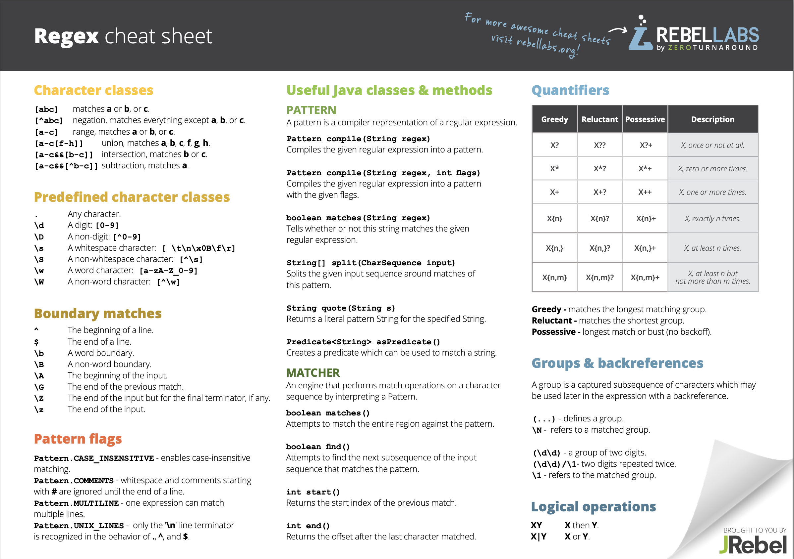

# RegEx




## Notepad++ regex example
Created:	2/16/2018 8:18 AM

Before:
%22413579%,%1518552337832%,%2018-02-13 15:05:37%,%Burlington%,%MasterVisionServoBelt1_B%,%CleatedServo%,%ControllerHealth%,\N,%46.09%,%0.00%,\N,\N,\N,\N,\N,\N,\N,\N,\N,%0.01%,%0.00%,%0.00%,%0.00%,%0.00%,\N,\N

I wanted to find all lines that have %Burlington% and a systemName ending in _B% and replace only the %Burlington% with %Burlington2%

After:
%22413579%,%1518552337832%,%2018-02-13 15:05:37%,%Burlington2%,%MasterVisionServoBelt1_B%,%CleatedServo%,%ControllerHealth%,\N,%46.09%,%0.00%,\N,\N,\N,\N,\N,\N,\N,\N,\N,%0.01%,%0.00%,%0.00%,%0.00%,%0.00%,\N,\N

**This worked excellently:**
```
Find:        (.*)(?<BN>%Burlington%)(.*)(_B%)(.*)
Replace:    \1(?{BN}%Burlington2%)\3\4\5
```
Where:
() denote groups
(?<BN>... provided a named group for targeting
\1...\3\4\5 specifies the number of the group to be included in the replacement

A bit more trial and research found that the following worked just as well:
Find:         (.*)(%Burlington%)(.*)(_B%)(.*)
Replace:     \1%Burlington2%\3\4\5
